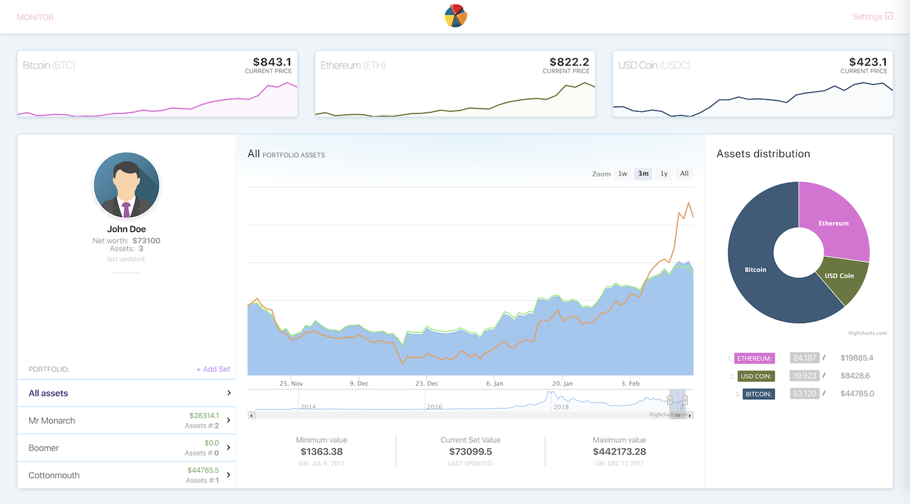

# Crypto Currency Monitor

A comprehensive dashboard to track all your crypto investments and savings. <br/>
Overtime performance and current state of affairs.  
*Link to [demo]()*



## Getting Started

The project is made to showcase React-Redux application `/client` in combination with headless Ruby on Rails application `/server` as API. <br/>
All dockerized and orchestrated with docker compose for effortless infrastructure management.<br/>
API also integrates with [coinmarketcap](https://coinmarketcap.com/) to get the latest updates about asset values.

### Prerequisites

>To get up an running you need this to be installed on your machine:
* [Docker](https://www.docker.com/)
* [git](https://git-scm.com/)

### Installing

> Here is the steps you need to execute to get all setup:

```
$ git clone https://github.com/tim-kozak/redux-rails.git
$ cd redux-rails
$ docker-compose up -d
$ open http://0.0.0.0:8080/
```
> One-liner:
```
$ git clone https://github.com/tim-kozak/redux-rails.git && cd redux-rails && docker-compose up -d && open http://0.0.0.0:8080/
```

## Tech stack

Client:
* Webpack - building, loading, running
* React - view rendering
* Redux - store management
* redux-thunk - async actions
* reselect - data processing
* other: axios, moment, highcharts, react-sparklines, scss

Server:
* Ruby on rails - web framework in headless mode
* JWT and bcrypt - for authentication 
* active_model_serializers - models serializer
* rack-cors - Cross-Origin Resource Sharing settings
* pg - PostgresSQL connector
* seeds - demo data generation 

## Running the tests

>API part is covered by model and integration tests written using:
* [RSpec](https://rspec.info/) - Ruby on rails testing framework
* [Shoulda](https://github.com/thoughtbot/shoulda) - Advanced test syntax and format
* [shoulda-matchers](https://github.com/thoughtbot/shoulda-matchers) - Additional one line matchers syntax    
* [factory_bot](https://github.com/thoughtbot/factory_bot) - Model factories 
* [faker](https://github.com/faker-ruby/faker) - Fake data generator (currencies, users, portfolio)

>All endpoints are covered with tests that check:
- [x] Authentication
- [x] Error messages
- [x] Response format
- [x] Statuse codes 

to launch tests use:
```
$ docker exec -it monitor-server /bin/sh
$ bundle exec rspec -fd
```

## Versioning

API uses version namespace `/api/v1/` for flexibility and future updates

